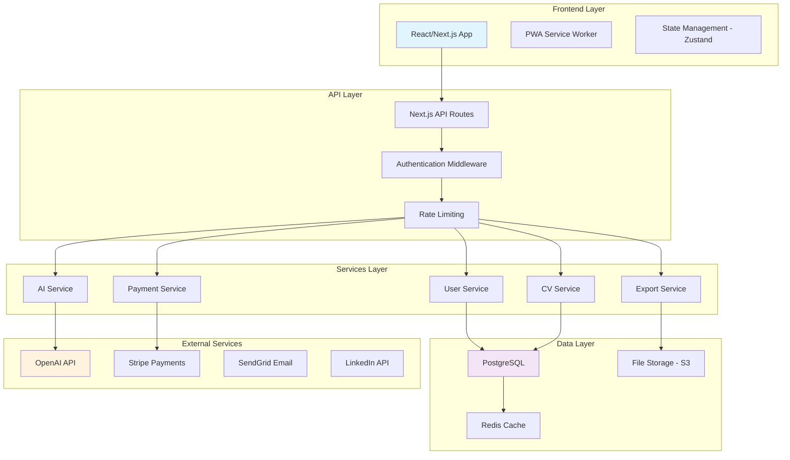
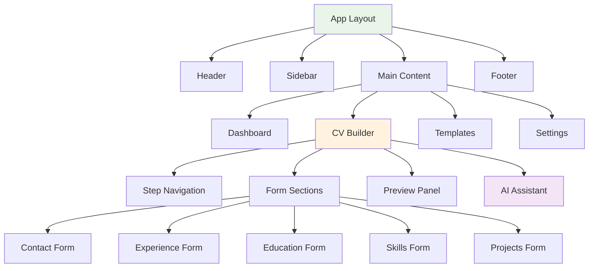
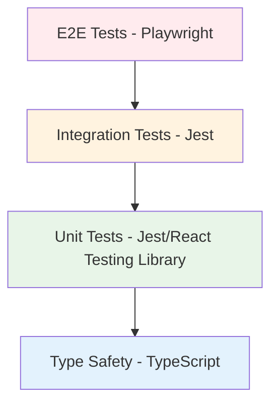

# Design Document

## Overview

El diseño propone una arquitectura moderna de aplicación web full-stack que transforma el actual creador de CV en una plataforma profesional. La solución utiliza React/Next.js para el frontend, Node.js/Express para el backend, PostgreSQL para datos estructurados, y servicios cloud para escalabilidad. El diseño prioriza la experiencia del usuario, seguridad, y un modelo de negocio freemium sostenible.

## Architecture

### High-Level Architecture



### Technology Stack

**Frontend:**
- Next.js 14 con App Router para SSR/SSG
- React 18 con TypeScript para type safety
- Tailwind CSS para styling consistente
- Zustand para state management
- React Hook Form para formularios
- Framer Motion para animaciones

**Backend:**
- Next.js API Routes para endpoints
- Prisma ORM para database operations
- NextAuth.js para autenticación
- Zod para validación de datos
- Rate limiting con upstash/ratelimit

**Database & Storage:**
- PostgreSQL para datos relacionales
- Redis para caching y sessions
- AWS S3 para almacenamiento de archivos
- Cloudinary para procesamiento de imágenes

**External Services:**
- OpenAI GPT-4 para funcionalidades de IA
- Stripe para procesamiento de pagos
- SendGrid para emails transaccionales
- LinkedIn API para importación de datos

## Components and Interfaces

### Frontend Components Architecture



### Key Component Interfaces

**CVBuilder Component:**
```typescript
interface CVBuilderProps {
  cvId?: string;
  template?: TemplateType;
  onSave: (data: CVData) => Promise<void>;
  onExport: (format: ExportFormat) => Promise<void>;
}

interface CVData {
  id: string;
  name: string;
  template: TemplateType;
  contact: ContactInfo;
  summary: string;
  experience: Experience[];
  education: Education[];
  skills: string[];
  projects: Project[];
  certifications: Certification[];
  customSections: CustomSection[];
}
```

**AI Assistant Component:**
```typescript
interface AIAssistantProps {
  context: CVData;
  jobDescription?: string;
  onSuggestion: (suggestion: AISuggestion) => void;
  isPremium: boolean;
}

interface AISuggestion {
  type: 'content' | 'structure' | 'keywords' | 'optimization';
  section: string;
  suggestion: string;
  confidence: number;
  premium: boolean;
}
```

### API Endpoints Design

**Authentication Endpoints:**
```
POST /api/auth/register
POST /api/auth/login
POST /api/auth/logout
GET  /api/auth/me
POST /api/auth/forgot-password
POST /api/auth/reset-password
```

**CV Management Endpoints:**
```
GET    /api/cvs              # List user's CVs
POST   /api/cvs              # Create new CV
GET    /api/cvs/:id          # Get specific CV
PUT    /api/cvs/:id          # Update CV
DELETE /api/cvs/:id          # Delete CV
POST   /api/cvs/:id/duplicate # Duplicate CV
```

**AI Services Endpoints:**
```
POST /api/ai/analyze-job     # Analyze job description
POST /api/ai/suggest-content # Generate content suggestions
POST /api/ai/optimize-cv     # Optimize CV for ATS
POST /api/ai/generate-cover-letter # Generate cover letter
```

**Export Endpoints:**
```
POST /api/export/pdf         # Export as PDF
POST /api/export/docx        # Export as Word document
POST /api/export/txt         # Export as plain text
GET  /api/export/share/:id   # Get shareable link
```

## Data Models

### Database Schema

```sql
-- Users table
CREATE TABLE users (
  id UUID PRIMARY KEY DEFAULT gen_random_uuid(),
  email VARCHAR(255) UNIQUE NOT NULL,
  password_hash VARCHAR(255) NOT NULL,
  name VARCHAR(255),
  subscription_tier VARCHAR(50) DEFAULT 'free',
  subscription_expires_at TIMESTAMP,
  created_at TIMESTAMP DEFAULT NOW(),
  updated_at TIMESTAMP DEFAULT NOW()
);

-- CVs table
CREATE TABLE cvs (
  id UUID PRIMARY KEY DEFAULT gen_random_uuid(),
  user_id UUID REFERENCES users(id) ON DELETE CASCADE,
  name VARCHAR(255) NOT NULL,
  description TEXT,
  template VARCHAR(100) DEFAULT 'modern',
  data JSONB NOT NULL,
  is_public BOOLEAN DEFAULT FALSE,
  share_token VARCHAR(255) UNIQUE,
  created_at TIMESTAMP DEFAULT NOW(),
  updated_at TIMESTAMP DEFAULT NOW()
);

-- Templates table
CREATE TABLE templates (
  id VARCHAR(100) PRIMARY KEY,
  name VARCHAR(255) NOT NULL,
  description TEXT,
  preview_url VARCHAR(500),
  is_premium BOOLEAN DEFAULT FALSE,
  category VARCHAR(100),
  config JSONB NOT NULL
);

-- User sessions table
CREATE TABLE user_sessions (
  id UUID PRIMARY KEY DEFAULT gen_random_uuid(),
  user_id UUID REFERENCES users(id) ON DELETE CASCADE,
  token VARCHAR(500) NOT NULL,
  expires_at TIMESTAMP NOT NULL,
  created_at TIMESTAMP DEFAULT NOW()
);

-- AI usage tracking
CREATE TABLE ai_usage (
  id UUID PRIMARY KEY DEFAULT gen_random_uuid(),
  user_id UUID REFERENCES users(id) ON DELETE CASCADE,
  feature VARCHAR(100) NOT NULL,
  tokens_used INTEGER DEFAULT 0,
  created_at TIMESTAMP DEFAULT NOW()
);
```

### Prisma Schema

```prisma
model User {
  id                    String    @id @default(cuid())
  email                 String    @unique
  passwordHash          String
  name                  String?
  subscriptionTier      String    @default("free")
  subscriptionExpiresAt DateTime?
  createdAt             DateTime  @default(now())
  updatedAt             DateTime  @updatedAt
  
  cvs                   CV[]
  sessions              UserSession[]
  aiUsage               AIUsage[]
  
  @@map("users")
}

model CV {
  id          String   @id @default(cuid())
  userId      String
  name        String
  description String?
  template    String   @default("modern")
  data        Json
  isPublic    Boolean  @default(false)
  shareToken  String?  @unique
  createdAt   DateTime @default(now())
  updatedAt   DateTime @updatedAt
  
  user        User     @relation(fields: [userId], references: [id], onDelete: Cascade)
  
  @@map("cvs")
}
```

## Error Handling

### Error Response Format

```typescript
interface APIError {
  error: {
    code: string;
    message: string;
    details?: any;
    timestamp: string;
  };
}

// Example error responses
const errors = {
  UNAUTHORIZED: {
    code: 'UNAUTHORIZED',
    message: 'Authentication required',
    status: 401
  },
  PREMIUM_REQUIRED: {
    code: 'PREMIUM_REQUIRED',
    message: 'This feature requires a premium subscription',
    status: 403
  },
  CV_NOT_FOUND: {
    code: 'CV_NOT_FOUND',
    message: 'CV not found or access denied',
    status: 404
  },
  RATE_LIMIT_EXCEEDED: {
    code: 'RATE_LIMIT_EXCEEDED',
    message: 'Too many requests. Please try again later.',
    status: 429
  }
};
```

### Frontend Error Handling

```typescript
// Global error boundary
class ErrorBoundary extends React.Component {
  handleError(error: Error, errorInfo: ErrorInfo) {
    // Log to monitoring service
    console.error('Application error:', error, errorInfo);
    
    // Show user-friendly message
    toast.error('Something went wrong. Please try again.');
  }
}

// API error handling
const handleAPIError = (error: APIError) => {
  switch (error.error.code) {
    case 'PREMIUM_REQUIRED':
      showUpgradeModal();
      break;
    case 'RATE_LIMIT_EXCEEDED':
      toast.warning('Please wait before trying again');
      break;
    default:
      toast.error(error.error.message);
  }
};
```

## Testing Strategy

### Testing Pyramid



### Test Categories

**Unit Tests (70%):**
- Component rendering and behavior
- Utility functions
- API route handlers
- Business logic functions

**Integration Tests (20%):**
- API endpoint testing
- Database operations
- External service integrations
- Authentication flows

**E2E Tests (10%):**
- Complete user workflows
- Payment processing
- CV creation and export
- Cross-browser compatibility

### Test Implementation

```typescript
// Component test example
describe('CVBuilder', () => {
  it('should save CV data when form is submitted', async () => {
    const mockSave = jest.fn();
    render(<CVBuilder onSave={mockSave} />);
    
    // Fill form
    await user.type(screen.getByLabelText('Name'), 'John Doe');
    await user.click(screen.getByRole('button', { name: 'Save' }));
    
    expect(mockSave).toHaveBeenCalledWith(
      expect.objectContaining({
        contact: expect.objectContaining({
          name: 'John Doe'
        })
      })
    );
  });
});

// API test example
describe('/api/cvs', () => {
  it('should create new CV for authenticated user', async () => {
    const response = await request(app)
      .post('/api/cvs')
      .set('Authorization', `Bearer ${validToken}`)
      .send({
        name: 'My CV',
        template: 'modern',
        data: mockCVData
      });
    
    expect(response.status).toBe(201);
    expect(response.body.data.name).toBe('My CV');
  });
});
```

## Security Considerations

### Authentication & Authorization

- JWT tokens with short expiration (15 minutes)
- Refresh token rotation
- Rate limiting per user and IP
- CSRF protection with SameSite cookies
- Input validation with Zod schemas

### Data Protection

- Encryption at rest for sensitive data
- HTTPS enforcement
- SQL injection prevention with Prisma
- XSS protection with Content Security Policy
- Regular security audits and dependency updates

### Privacy Compliance

- GDPR compliance with data export/deletion
- Clear privacy policy and terms of service
- Opt-in analytics and marketing communications
- Secure handling of payment information (PCI DSS)

## Performance Optimization

### Frontend Performance

- Code splitting by route and feature
- Image optimization with Next.js Image component
- Lazy loading for non-critical components
- Service Worker for offline functionality
- Bundle analysis and optimization

### Backend Performance

- Database query optimization with indexes
- Redis caching for frequently accessed data
- CDN for static assets
- API response compression
- Connection pooling for database

### Monitoring & Analytics

- Real User Monitoring (RUM)
- Core Web Vitals tracking
- Error tracking with Sentry
- Performance monitoring with Vercel Analytics
- Business metrics dashboard